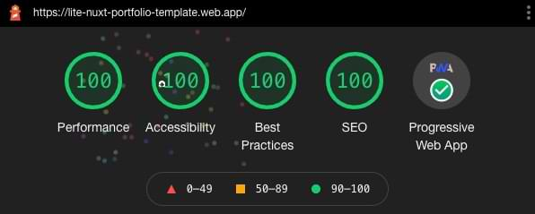
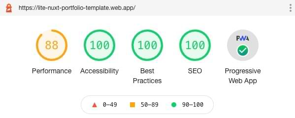

# Lite Nuxt Portfolio Template

 

## A lite version of portfolio template for Developers.

<br>

### Lighthouse Score:

<p align="center"><b>Desktop</b></p>

<p align="center">

</p>


<br>

<p align="center"><b>Mobile</b></p>

<p align="center">

</p>


<br>

### Desktop View:


---

<br>

### Mobile View:


---

# Features

✅ **Mobile-first UI Design** 📱

✅ **Fully Responsive** 🖥

✅ **Full Static Generation** 🚀

✅ **Styled with Tailwindcss 2.0** 🎨

✅ **Dark Mode (Auto & Manual)** 🌚

<br>

[](https://lite-nuxt-portfolio-template.web.app/)

<br>

[](https://liewjenglung.com/)

# Usage

```bash
# Download this repository to local machine
$ git clone https://github.com/kenxdrgn/lite-i18n-portfolio-template

# Go into the repository
$ cd lite-i18n-portfolio-template

# Install dependencies
$ npm install

# Serve with hot reload at localhost:3000
$ npm run dev
```

For i18n features, please refer to the [nuxt-i18n-portfolio-template](https://github.com/kenxdrgn/nuxt-i18n-portfolio-template).

